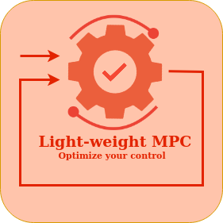

# Light-weight MPC
### - A simulation software for MPC control
This is a repo for implementing the master's thesis for the study programme [Cybernetics & Robotics](https://www.ntnu.no/studier/mttk) at **NTNU**. The thesis is handed out by **Equinor**, and aims on implementing a simpler software framework simulating optimized control on step response models. 

[Project thesis description](https://www.itk.ntnu.no/ansatte/imsland_lars/projects2022.html)

#### Master student: 
- Geir Ola Tvinnereim

#### Supervisors:
- Prof. Lars Struen Imsland (ITK) 
- Dr. Gisle Otto Eikrem (Equinor)

### Purpose:
The purpose of the software is to shine light on Model Predictive Controllers providing a neat and lightweight simulation tool for a JavaScript React frontend and C++ backend. 

Software applications:
- Industrial use, determing the optimal MPC tuning.
- Academic framework understanding the controller method. 

## backend - MPC-simulator
- C/C++ module for simulating an MPC controller on an FSRM
- Python module using pyplot.matplotlib to visualise simulation data
- Emscripten compiler to compile code to Webassembly format to interface JavaScript
## frontend - Web-application
- JavaScript React web application implemented using Create-React-App.

### LICENCE:
Released under the terms of the BSD 3-Clause License
